# 人工智能 Lab2-Part1 实验报告
> 实验题目：国际象棋Checkmate预测  
> 姓名：王博， 学号：PB16020870

- [人工智能 Lab2-Part1 实验报告](#%E4%BA%BA%E5%B7%A5%E6%99%BA%E8%83%BD-lab2-part1-%E5%AE%9E%E9%AA%8C%E6%8A%A5%E5%91%8A)
  - [1. 实验要求概述](#1-%E5%AE%9E%E9%AA%8C%E8%A6%81%E6%B1%82%E6%A6%82%E8%BF%B0)
    - [1.1 数据集介绍](#11-%E6%95%B0%E6%8D%AE%E9%9B%86%E4%BB%8B%E7%BB%8D)
    - [1.2 实现算法的要求概述](#12-%E5%AE%9E%E7%8E%B0%E7%AE%97%E6%B3%95%E7%9A%84%E8%A6%81%E6%B1%82%E6%A6%82%E8%BF%B0)
    - [1.3 评估要求概述](#13-%E8%AF%84%E4%BC%B0%E8%A6%81%E6%B1%82%E6%A6%82%E8%BF%B0)
    - [1.4 交叉验证/参数选择要求概述](#14-%E4%BA%A4%E5%8F%89%E9%AA%8C%E8%AF%81%E5%8F%82%E6%95%B0%E9%80%89%E6%8B%A9%E8%A6%81%E6%B1%82%E6%A6%82%E8%BF%B0)
    - [1.5 提交报告要求概述](#15-%E6%8F%90%E4%BA%A4%E6%8A%A5%E5%91%8A%E8%A6%81%E6%B1%82%E6%A6%82%E8%BF%B0)
  - [2. 目录结构](#2-%E7%9B%AE%E5%BD%95%E7%BB%93%E6%9E%84)
  - [3. 算法实现](#3-%E7%AE%97%E6%B3%95%E5%AE%9E%E7%8E%B0)
    - [3.1 K近邻算法实现](#31-k%E8%BF%91%E9%82%BB%E7%AE%97%E6%B3%95%E5%AE%9E%E7%8E%B0)
    - [3.2 决策树ID3算法实现](#32-%E5%86%B3%E7%AD%96%E6%A0%91id3%E7%AE%97%E6%B3%95%E5%AE%9E%E7%8E%B0)
    - [3.3 多分类SVM实现](#33-%E5%A4%9A%E5%88%86%E7%B1%BBsvm%E5%AE%9E%E7%8E%B0)
    - [3 算法运行与可视化](#3-%E7%AE%97%E6%B3%95%E8%BF%90%E8%A1%8C%E4%B8%8E%E5%8F%AF%E8%A7%86%E5%8C%96)
    - [3.1 KNN算法运行](#31-knn%E7%AE%97%E6%B3%95%E8%BF%90%E8%A1%8C)
    - [3.2 决策树算法运行与可视化](#32-%E5%86%B3%E7%AD%96%E6%A0%91%E7%AE%97%E6%B3%95%E8%BF%90%E8%A1%8C%E4%B8%8E%E5%8F%AF%E8%A7%86%E5%8C%96)
    - [3.3 SVM算法调试与运行](#33-svm%E7%AE%97%E6%B3%95%E8%B0%83%E8%AF%95%E4%B8%8E%E8%BF%90%E8%A1%8C)
    - [4 评估算法实现和数据特征处理](#4-%E8%AF%84%E4%BC%B0%E7%AE%97%E6%B3%95%E5%AE%9E%E7%8E%B0%E5%92%8C%E6%95%B0%E6%8D%AE%E7%89%B9%E5%BE%81%E5%A4%84%E7%90%86)
    - [4.1 评估算法实现](#41-%E8%AF%84%E4%BC%B0%E7%AE%97%E6%B3%95%E5%AE%9E%E7%8E%B0)
    - [4.2 手动数据降维思路](#42-%E6%89%8B%E5%8A%A8%E6%95%B0%E6%8D%AE%E9%99%8D%E7%BB%B4%E6%80%9D%E8%B7%AF)
    - [4.3 特征处理前后初步比较(KNN)](#43-%E7%89%B9%E5%BE%81%E5%A4%84%E7%90%86%E5%89%8D%E5%90%8E%E5%88%9D%E6%AD%A5%E6%AF%94%E8%BE%83knn)
    - [4.4 特征的手动处理/PCA降维/不处理综合比较](#44-%E7%89%B9%E5%BE%81%E7%9A%84%E6%89%8B%E5%8A%A8%E5%A4%84%E7%90%86pca%E9%99%8D%E7%BB%B4%E4%B8%8D%E5%A4%84%E7%90%86%E7%BB%BC%E5%90%88%E6%AF%94%E8%BE%83)
  - [5. K折交叉验证](#5-k%E6%8A%98%E4%BA%A4%E5%8F%89%E9%AA%8C%E8%AF%81)
    - [5.1 K折交叉验证算法实现](#51-k%E6%8A%98%E4%BA%A4%E5%8F%89%E9%AA%8C%E8%AF%81%E7%AE%97%E6%B3%95%E5%AE%9E%E7%8E%B0)
    - [5.2 K近邻算法：5折交叉验证](#52-k%E8%BF%91%E9%82%BB%E7%AE%97%E6%B3%955%E6%8A%98%E4%BA%A4%E5%8F%89%E9%AA%8C%E8%AF%81)
    - [5.3 决策树ID3算法：5折交叉验证](#53-%E5%86%B3%E7%AD%96%E6%A0%91id3%E7%AE%97%E6%B3%955%E6%8A%98%E4%BA%A4%E5%8F%89%E9%AA%8C%E8%AF%81)
    - [5.4 SVM算法：5折交叉验证](#54-svm%E7%AE%97%E6%B3%955%E6%8A%98%E4%BA%A4%E5%8F%89%E9%AA%8C%E8%AF%81)
  - [6. 评估结果和图表分析](#6-%E8%AF%84%E4%BC%B0%E7%BB%93%E6%9E%9C%E5%92%8C%E5%9B%BE%E8%A1%A8%E5%88%86%E6%9E%90)
    - [6.1 KNN算法](#61-knn%E7%AE%97%E6%B3%95)
    - [6.2 决策树算法](#62-%E5%86%B3%E7%AD%96%E6%A0%91%E7%AE%97%E6%B3%95)
    - [6.3 SVM算法](#63-svm%E7%AE%97%E6%B3%95)
  - [7. 实验总结](#7-%E5%AE%9E%E9%AA%8C%E6%80%BB%E7%BB%93)

## 1. 实验要求概述

### 1.1 数据集介绍
- Krkopt是一个国际象棋的残局数据集，在这张残局的棋盘上，只有白手国王（White King）、白手车（White Rook）、黑手国王（Black King）。本次实验的任务是在给定前面所述的三者的位置的前提下，预测白手玩家能将军所需要的最少步数（这里假设两个玩家的每步走法都是最优的）。
- 数据中包含7个属性（含类别），共有28056个样本，数据属性（含类别）如下所述：
  1. 白手国王的列坐标（White King Column）
  2. 白手国王的行坐标（White King Row）
  3. 白手车的行坐标（White Rook Column）
  4. 白手车的列坐标（White Rook Row）
  5. 黑手国王的行坐标（Black King Column）
  6. 黑手国王的列坐标（Black King Row）
- 类别：最优步数（optimal depth-of-win），从0~16取值，若无法取胜，则为draw，具体分布如下图所示

### 1.2 实现算法的要求概述
- 提交一个KNN.py文件，要求通过K近邻算法来解决多分类的问题。
- 提交一个decisionTree.py文件，要求调研决策树算法（ID3）并实现来解决多分类的问题。
- 提交一个SVM.py文件，要求通过多分类SVM算法来解决多分类的问题。
- 详细要求略。

### 1.3 评估要求概述
- 每个文件的核心函数都要返回对测试数据testset的预测ypred，以及与testlabel进行比较后计算得到的性能指标Accuracy、Macro F1和Micro F1。
- 详细要求略。

### 1.4 交叉验证/参数选择要求概述
- 在数据集上使用交叉验证法来进行训练集和验证集的划分及训练（使用5-fold交叉验证），同时为每个算法挑选合适的参数。
- 详细要求略。

### 1.5 提交报告要求概述

1. 给出你对各个属性间关系进行处理的思路（若是直接进行训练，可以不写）；
2. 分别给出算法的伪代码；
3. 根据评价指标，给出模型评估结果，要求给出对应的图表分析。

## 2. 目录结构

```
.
├── KNN.py                  | K近邻
├── SVM.py                  | 支持向量机
├── crossValidation.py      | 交叉验证
├── data
│   ├── _tool.py            | 随机缩减数据量
│   ├── testset.csv         | 测试集数据
│   ├── testsetsmall.csv    | 随机缩减的测试集数据（用于SVM）
│   ├── trainset.csv        | 训练集数据
│   └── trainsetsmall.csv   | 随机缩减的训练集数据（用于SVM）
├── decisionTree.py         | 决策树
├── doc
│   ├── lab2_part1.md       | 本部分实验报告
│   └── pics(截图)
│       └── ....
└── util
    ├── PCA.py              | 主成分分析
    ├── __init__.py
    ├── evaluate.py         | 评估
    ├── getdata.py          | 获取数据
    ├── gzwrite.py          | 决策树可视化写.dot文件
    └── myprint.py          | 辅助显示
```

## 3. 算法实现

### 3.1 K近邻算法实现

实现KNN需要度量两个元素之间的距离。我的做法是，把所有棋子坐标转换为序数，字母转换为ascii码，一个元素即一个6维矢量。可以选择的距离有欧式距离和曼哈顿距离。

实现K近邻算法需要实现如下函数。伪代码如下：
- KNN主函数：
```python
def knn(trainset:list, trainlabel:list, testset:list, testlabel:list, k:int):
    类别 = 对trainlabel去重
    预测标签列表 = list()
    for 测试元素 in testset:
        预测类别 = knn_core(测试元素, trainset, trainlabel, k)
        预测标签列表.append(预测类别)
    Accuracy, MacroF1, MicroF1 = 评估(类别, testlabel, 预测标签列表)
    return 预测标签列表, Accuracy, MacroF1, MicroF1
```

- KNN处理单个元素的函数：
```python
def knn_core(当前待处理元素, trainset:list, trainlabel:list, nb_num:int, debug=False):
    """knn算法"""
    创建邻居列表
    for 元素, 标签 in zip(trainset, trainlabel):
        更新邻居列表(当前待处理元素, 元素, 标签, 邻居列表, 邻居个数)
    预测结果 = 根据邻居列表判断最多类别(邻居列表)
    return 预测结果
```

- 更新邻居列表：
```python
def update_neighbors(中心元素, 元素, 标签, 邻居列表: list, 邻居个数限制: int):
    """更新邻居, 插入排序实现"""
    # 邻居按照小根堆堆排列。序为到中心元素的距离
    将新元素放在尾部
    调整小根堆
    if 堆元素超过邻居个数:
        移除堆尾部1个元素
```

### 3.2 决策树ID3算法实现

实现决策树ID3需要实现如下函数。使用的算法版本在老师PPT基础上稍作修改但逻辑相同：  
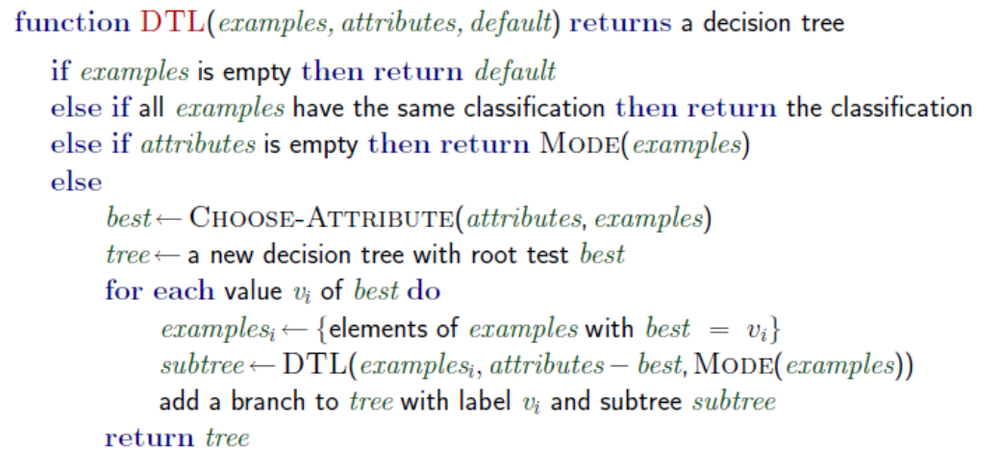  
伪代码如下：

- 决策树核心函数：
```python
def createTree(trainset:list, trainlabel:list, testset:list, testlabel:list):
    决策树 = 创建决策树(trainset, trainlabel)
    创建预测标签列表
    for 元素 in testset:
        预测标签列表.append(决策树.预测(元素))
    Accuracy, MacroF1, MicroF1 = 评估(训练集所有类别, testlabel, 预测标签列表)
    return predict_label, Accuracy, MacroF1, MicroF1
```

- 决策树生成函数：
```python
def createTree_core(dataset:list, datalabel:list):
    """递归建树函数
    返回：数根节点
    """
    最佳特征, 信息熵, 信息增益 = chooseBestFeature(dataset, datalabel)
    if 最佳特征存在:
        特征取值到数据集合映射 = 根据一个特征分割数据集(dataset, datalabel, 最佳特征)
        当前预测默认值 = 当前比例最高的类别
        当前节点 = 创建决策树节点(最佳特征, 信息熵, 信息增益, 当前预测默认值)
        for 特征取值 → (数据集合，标签集合) in 特征取值到数据集合映射:
            当前节点.该特征取值的孩子 = createTree_core(数据集合，标签集合)
        return 当前节点
    else:
        # 叶节点
        叶节点标签 = 当前数据集合的公共标签
        return (叶节点, 数据元素个数)
```

- 信息熵和条件熵的计算略，理论来自老师PPT:  
  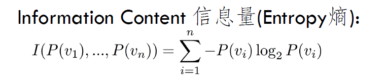  
  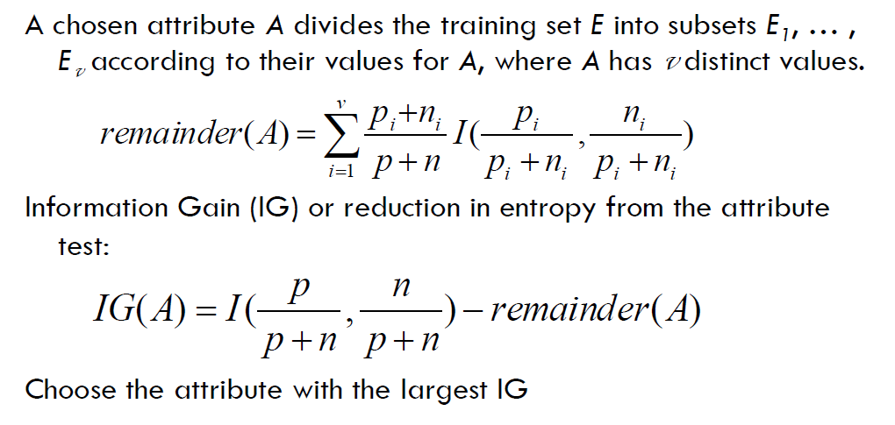

- 选择最佳特征函数：
```python
def chooseBestFeature(dataset:list, datalabel:list):
    """选择最好的特征
    返回：最好的特征, 当前信息熵, 最佳特征的信息增益
    """
    当前信息熵 = 计算信息熵(dataset, datalabel)
    最低信息熵 = current_entropy
    最佳特征 = None
    for 特征 in 特征列表:
        条件熵 = 计算条件熵(特征, dataset, datalabel)
        更新最低熵和最佳特征(条件熵)
    信息增益 = 当前信息熵 - 最低信息熵
    return 最佳特征，当前信息熵，最佳特征的信息增益
```

- 决策树的预测方法：
```python
class DecisionTreeNode:
    ...
    def 预测(self, 元素):
        特征取值 = 元素[self.特征]
        if 特征取值 in self.tree_dict:
            # 这个feature值，在子树字典中存在
            子节点 = self.子节点映射(特征取值)
            if 子节点的类型是 DecisionTreeNode:
                return 子节点.预测(元素)
            else:
                return 本节点预测值
        else:
            return 本节点.默认预测值
    ...
```


### 3.3 多分类SVM实现

实现多分类SVM需要实现如下函数。伪代码如下：


- 多分类核心函数：
```python
def multiClassSVM(trainset, trainlabel, testset, testlabel, sigma=1, marginC=10):
    # trainset, trainlabel, testset, testlabel 是训练集和测试集
    # sigma=1 是默认的高斯核函数sigma值
    # marginC=10 是默认的软边界参数
    创建类别到SVM的映射
    for 目标类别 in 所有类别:
        myfilter = 
        过滤后标签列表 = 对于每个标签按照标签是否等于目标类别来置位 1 或 -1
        类别到SVM的映射[目标类别] = softSVM(trainset, 过滤后标签列表, sigma, marginC)
    
    # 做预测
    预测标签 = 列表()
    for 元素 in 测试集:
        for 类别 in 类别到SVM的映射:
            预测y值 = 类别到SVM的映射[类别].predict(元素)
            if 预测y值 > 最佳预测y值:
                最佳预测y值 = 预测y值
                猜测的类别 = 类别
        预测标签.append(猜测的类别)
    
    # 评估
    Accuracy, MacroF1, MicroF1 = 评估(所有类别, 测试标签, 预测标签)
    return 预测标签, Accuracy, MacroF1, MicroF1
```

- 核函数
```python
def svm_kernel(x1, x2, sigma):
    if sigma = 0: 返回线性核函数求值
    else 带入sigma返回高斯核函数求值
```

- 软间隔SVM生成
```python

def softSVM(trainset, trainlabel, sigma, marginC):
    """marginC为soft margin控制参数"""
    所有alpha = 求解所有向量alpha(trainset, trainlabel, sigma, marginC)
    创建一个SVM对象
    alpha阈值 = 6e-5
    将所有alpha超过阈值的向量加入支持向量列表
    找出最大alpha，最大alpha对应向量
    SVM的b = SUM(最大alpha的y值 - 所有向量与最大alpha支持向量核函数值)
    return 新建的SVM
```

- 求解所有向量的alpha
  - 本部分理论基础是老师的PPT:  
  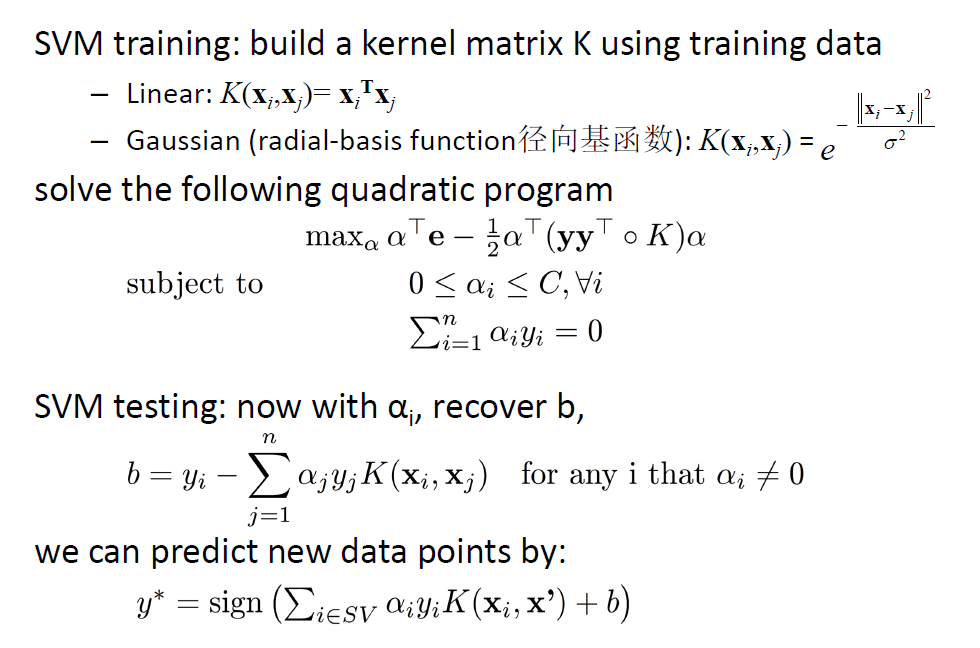
  - 本部分的实现需要如下依赖：
    - 使用了python的qpsolvers库来求解二次规划问题
    - 使用的二次规划求解器是osqp，其可以处理稀疏矩阵。
    - 使用的稀疏矩阵形式是scipy.sparse中的csc_matrix。
    - 私用的矩阵运算库是numpy。
  - qpsolvers要求的输入格式为：
  ```python
    def solve_qp(P, q, G=None, h=None, A=None, b=None, solver='quadprog',
             initvals=None, sym_proj=False):
    """
    Solve a Quadratic Program defined as:

        minimize
            (1/2) * x.T * P * x + q.T * x

        subject to
            G * x <= h
            A * x == b

    using one of the available QP solvers.
    ...

  ```
  伪代码如下：
```python
def solve_sparse(trainset, trainlabel, sigma, marginC):
    train_size = len(trainset)
    K = 长宽为元素个数的核函数矩阵
    在K的对角线增加一个小量1e-5

    q = 长度为元素个数的全部由 -1 组成的向量
    
    G1 = 稀疏矩阵(长宽为元素个数的单位对角阵)
    G2 = 稀疏矩阵(长宽为元素个数的负单位对角阵)
    G = 纵向拼接G1, G2

    h1 = 长度为元素个数的全为marginC的向量
    h2 = 长度为元素个数的全为0的向量
    h = 纵向拼接h1和h2

    A = 稀疏矩阵(训练标签) 
    b = np.asarray([0])
    
    所有alpha求解结果 = 求解二次规划(目标函数(K, q), 小于约束(G, h), 等于约束(A, b), 求解器='osqp')
    return 所有alpha求解结果
```
### 3 算法运行与可视化

### 3.1 KNN算法运行

- 用全部数据运行KNN，截图如下：  
  
可见准确度有0.69。关于其中的评估值的详细说明，在第四节评估算法实现。

### 3.2 决策树算法运行与可视化

- 用全部数据运行决策树，截图如下：  
  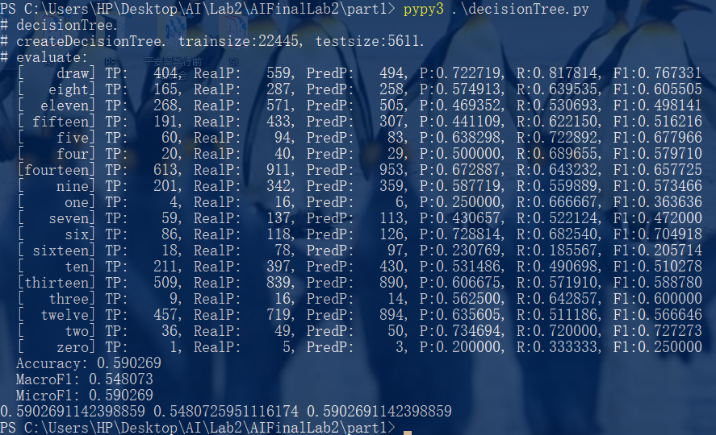  
  准确度有0.59.

- 在生成可视化时，由于全部展开太大，所以我每一层仅随即展开一个节点。自动生成的dot文件如图：
  ```dot
  digraph decisionTree{
    ordering = out;
    61508256 [color=green, label="draw
    2"];
    61508240 [color=green, label="draw
    2"];
    61508304 [color=green, label="nine
    2"];
    61508288 [color=green, label="nine
    2"];
    61508272 [color=green, label="nine
    2"];
    61474224 [label="F4
    (nine)"];
    61474224 -> 61508240[label="g"];
    61474224 -> 61508256[label="h"];
    61474224 -> 61508272[label="e"];
    61474224 -> 61508288[label="f"];
    61474224 -> 61508304[label="d"];
    ...
  ```
  根据dot文件导出图片为(每层只展开了一个节点)：    
  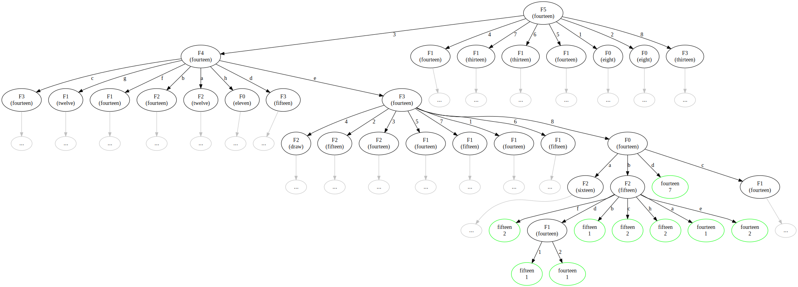
  

### 3.3 SVM算法调试与运行

- 首先，我用程序生成了一些二维点，然后有用假想的分界面生成测试样例。尝试用SVM看能否正确分类。
  - 我首先尝试了两类完全可分离的情况（线性核函数）：  
    
  如图可以看到，算法正确的找出了三个支持向量的位置，并且在测试样例上对了99个。准确率很好。  
  - 接着我又尝试了两类在边界处有渗透的情况（线性核函数）：  
  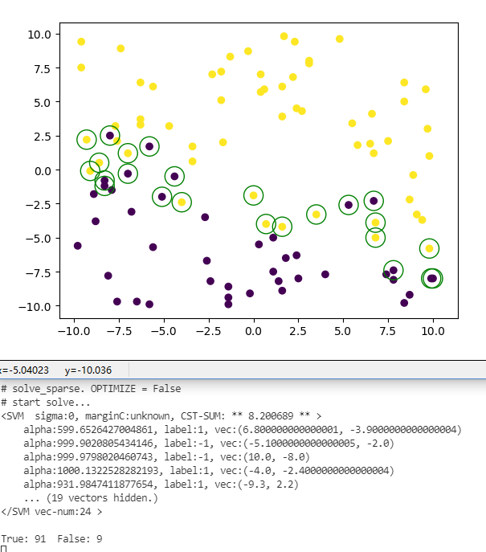  
    
  可以看到，设置的C=10起了作用，限制了软边界。由于是软边界，支持向量多了很多，alpha的绝对值超过给定阈值的达到几十个。
  分类效果仍然较好，100个里对了97/95个。
  - 然后我换用高斯核函数，尝试了两类完全可分离的情况（高斯核函数）：  
  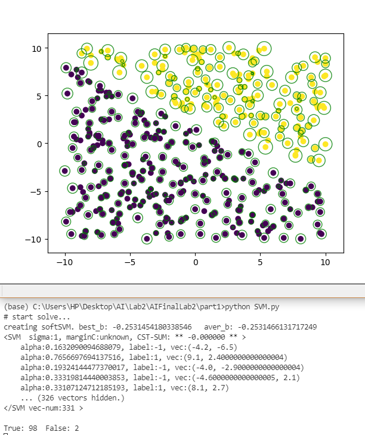  
  分类效果较好，准确率高。并且，我根据alpha值的大小决定绘制圈的大小，可以看到重要的支持变量倾向于出现在边界。  
  - 如果过滤超过某个alpha值的支持向量，得到的图像如下。不规则的分类边界被支持向量标出：  
  
  - 接着又尝试了两类在边界处有渗透的情况（高斯核函数）：  
  
  分类效果就不是很理想了。

- 接下来，我从训练数据中抽取了2500条，从测试数据中抽取了1800条，做测试：  
  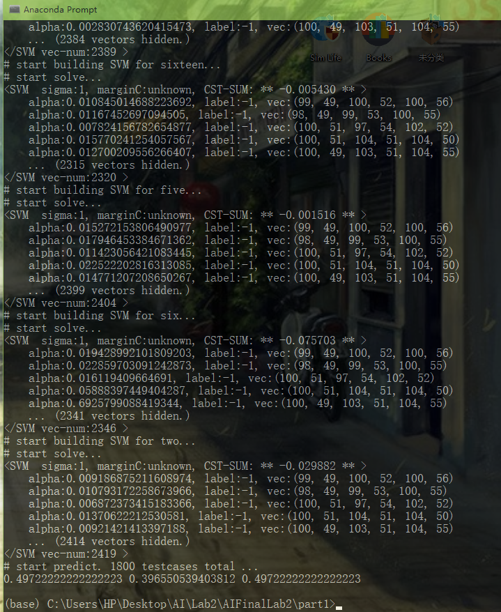  
  可见，在训练数据只有2500条的情况下，就已经达到了0.5的准确率。说明SVM算法实现正确，在本问题上可用。

### 4 评估算法实现和数据特征处理

### 4.1 评估算法实现

实现了三个评估函数：Accuracy, Macro F1, Micro F1。  
理论基础在助教所给实验要求以及

- Accuracy（准确率），即正确预测的样本占所有测试样本的比重。
- Macro F1：将n分类的评价拆成n个二分类的评价，计算每个二分类的F1 score，n个 F1 score 的平均值即为 Macro F1。
- Micro F1：将n分类的评价拆成n个二分类的评价，将n个二分类评价的TP、FP、FN对应相加，计算评价准确率和召回率，由这2个准确率和召回率计算的F1 score即为Micro F1。
- F1的计算： 
  $$ F_1 = \frac{2 * P * R}{(P + R)} $$
  其中准确率P和召回率R:
  $$ 
  P = \frac{T_P}{(T_P + F_P)},  
  R = \frac{T_P}{(T_P + F_N)}
  $$
- 值得注意的是:
  - 如果测试样例中含有训练样例全部类别，那么Micro F1的取值可能和Accuracy相同。
  - 如果测试样例不含训练样例全部类别，那么计算TP、FP和FN时，仅考虑真实结果中出现的类别，而不是全部类别。

### 4.2 手动数据降维思路

按照游戏规则，可知结果和棋子间相对位置关系较大。  
所以，我们忽略白手国王的绝对坐标，计算白手车和黑手国王相对于白手国王的相对位置。  
将6个维度减少到4个，变换如下：
$$(x_1, y_1, x_2, y_2, x_3, y_3) \Rightarrow (x_2 - x_1, y_2 - y_1, x_3 - x_1, y_3 - y_1)$$

### 4.3 特征处理前后初步比较(KNN)

- 首先，我不手动处理特征，直接用KNN（欧式距离）跑全部的训练数据和预测数据，结果如下：
  
Accuracy有0.687222。

- 然后，我手动按照3.2的思路将其降为4维，再跑，结果如下：
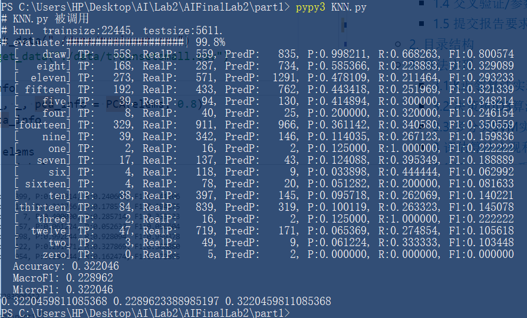  
Accuracy只有0.322046。

手动降低维度之后，准确率大幅度下降。  
我又尝试了其它一些降维方式，比如坐标两两相乘，结果仍然较差。为了排除是我降维方式有问题，接下来我尝试了PCA降维。

### 4.4 特征的手动处理/PCA降维/不处理综合比较

- 自己手动降维后，算法准确度下降了。于是，我尝试使用PCA方法，选前四个主成分，再尝试。PCA选出的4个主元的特征值占比达到了92.4%。各个特征值为 [0.248462, 0.240202, 0.231119, 0.204802, 0.056999, 0.018413]。

- 使用PCA降维后数据运行SVM的例子如图所示：  
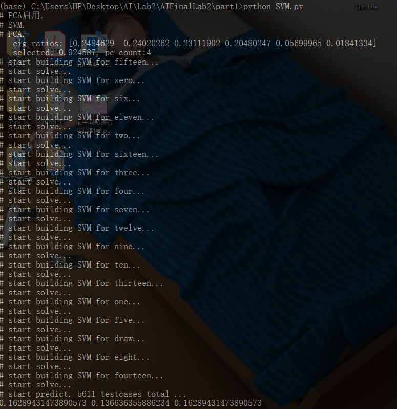

- 将所有尝试结果制作成表格如下：

| 算法名称 | 特征处理 | trainset使用 | Accuracy | Macro F1 | Micro F1 |
|:--:|:--:|:--:|:--:|:--:|:--:|
| KNN(欧式距离) | 不处理(6个) | 100% |  0.687222 | 0.630717 | 0.687222 |
| KNN(曼哈顿距离) | 不处理(6个) | 100% |  0.687578 | 0.631296 | 0.687578 |
| KNN(欧式距离) | 处理(4个) | 100% |  0.322046 | 0.228962 | 0.282837 |
| KNN(曼哈顿距离) | 处理(4个) | 100% |  0.322402 | 0.229786 | 0.322046 |
| KNN(欧式距离) | PCA(4个) | 100% |  0.258421 | 0.203423 | 0.258421 |
| KNN(曼哈顿距离) | PCA(4个) | 100% |  0.282837 | 0.202422 | 0.282837 |
| 决策树 | 不处理(6个) | 100% |  0.590269 | 0.548073 | 0.590269 |
| 决策树 | 处理(4个) | 100% |  冲突数据 | 冲突数据 | 冲突数据 |
| 决策树 | PCA(4个) | 100% |  0.162360 | 0.015520 | 0.162360 |
| SVM(σ=1,C=10) | 不处理(6个) | 11% |  0.497222 | 0.396550 | 0.497222 |
| SVM(σ=1,C=10) | 处理(4个) | 11% | 0.265555 | 0.195260 | 0.265555 |
| SVM(σ=1,C=10) | PCA(4个) | 11% |  0.280555 | 0.186044 | 0.280555 |

通过上述观察，可知处理效果确实不好，手动处理的比PCA得到的前四个主元稍好一些（尽管PCA的前四个主元占了92%特征值总和），而且对于决策树算法，手动处理过后还会发生冲突。  
根据上表综合比较，认为不降维更好。降维对于算法运行时间的收益不大，却极大的影响了准确度。

## 5. K折交叉验证
### 5.1 K折交叉验证算法实现

基本原理同老师PPT，交叉验证时只有一个训练集，将训练集K等分，然后取其中一份用来评估，剩下的用来训练。  
只要注意选取数据时要均匀采样，不能全部都是一类即可。

算法简单略，我实现的函数接口是：
```python
def crossValidation(
        func,       # 分类器（参数已消除）
        trainset,   # 训练数据
        trainlabel, # 训练标签
        fold:int    # 折数
    ):
    ...
    return 平均microF1, microF1列表
```

```python
def crossValidationParams(
        func_generator,         # 分类器生成函数（参数->分类器）
        params_list:list,       # 参数列表
        trainset:list,          # 训练集数据
        trainlabel:list,        # 训练集标签
        fold:int                # 交叉验证折数
    ):
    ....
    return {
        "mat":microF1均值矩阵(每一行是一个参数，每一列是一个Fold),
        "avers":microF1均值列表,
        "params":参数列表,
        "best_param":最佳参数,
        "max_microF1": microF1最大值,
        "idx":microF1最大值编号
    }
```

完成后运行效果如图：


### 5.2 K近邻算法：5折交叉验证
 | 邻居个数 | Fold 0 | Fold 1 | Fold 2 | Fold 3 | Fold 4 | 平均 MicroF1 |
 | :------: | :------: | :------: | :------: | :------: | :------: | :------: |
| (3,) | 0.626643 | 0.632880 | 0.625306 | 0.623079 | 0.628202 | 0.627222 |
| (5,) | 0.724883 | 0.725997 | 0.723101 | 0.718423 | 0.716418 | 0.721764 |
| (7,) | 0.736467 | 0.732903 | 0.743818 | 0.734239 | 0.737804 | 0.737046 |
| (9,) | 0.718423 | 0.716863 | 0.714636 | 0.723324 | 0.719091 | 0.718467 |
| (11,) | 0.712408 | 0.708844 | 0.709958 | 0.707953 | 0.703275 | 0.708487 |

经过交叉验证，可以看到最佳的邻居个数参数为7，此时Micro F1均值达到了0.73最大值。

### 5.3 决策树ID3算法：5折交叉验证
| 最小样本数量 | Fold 0 | Fold 1 | Fold 2 | Fold 3 | Fold 4 | 平均 MicroF1 |
| :------: | :------: | :------: | :------: | :------: | :------: | :------: |
| (0,) | 0.566273 | 0.546892 | 0.555580 | 0.561149 | 0.545110 | 0.555001 |
| (3,) | 0.565828 | 0.545333 | 0.554244 | 0.559145 | 0.546001 | 0.554110 |
| (5,) | 0.560258 | 0.539764 | 0.550902 | 0.555358 | 0.538204 | 0.548897 |
| (10,) | 0.534863 | 0.514591 | 0.533081 | 0.531076 | 0.512364 | 0.525195 |
| (20,) | 0.459568 | 0.438182 | 0.456226 | 0.443083 | 0.438405 | 0.447093 |

经过交叉验证，可以看到Micro F1的值随着最小样本数量的上升单调递减。所以，最佳的最小样本数量取值为0。

### 5.4 SVM算法：5折交叉验证

- 在我的SVM实现中，支持对sigma和C的调节，但是也有一些参数是不支持调节的。不支持调节的参数有：
  - 高斯核矩阵对角线小量1e-6
  - alpha近似为0的判别（小于最大alpha的0.5%）
- 可以调节的参数以及计划的调节范围是：
  - σ： 计划调节0, 1, 2, 平均距离, 平均距离/10, 平均距离/100。
  - C:  即算法中的marginC，计划调节10，20，1000
- 由于交叉验证很慢，我使用3600个元素的训练集先进行大规模交叉验证。找到最佳参数后，再用稍大一些的规模尝试最终结果。所有的参数组合和交叉验证结果在下表。

我使用的数据量都是3600大小的训练集。表格如下；
 | (σ,C) | Fold 0 | Fold 1 | Fold 2 | Fold 3 | Fold 4 | 平均 MicroF1 |
 | :------: | :------: | :------: | :------: | :------: | :------: | :------: |
| (0, 10)       | 0.018169 | 0.020029 | 0.016667 | 0.011111 | 0.051389 | 0.023473 |
| (0.4526, 10)  | 0.140278 | 0.175000 | 0.169444 | 0.208333 | 0.163889 | 0.171389 |
| (0.9052, 10)  | 0.514246 | 0.509722 | 0.498611 | 0.534722 | 0.519805 | 0.515421 |
| (1, 10)       | 0.525365 | 0.512500 | 0.511111 | 0.534722 | 0.530924 | 0.522924 | 
| (1.6, 10)     | 0.522949 | 0.546213 | 0.516667 | 0.508333 | 0.525365 | 0.523905 |
| (2, 10)       | 0.394719 | 0.502778 | 0.515278 | 0.404167 | 0.465601 | 0.456508 | 
| (4.5260, 10)  | 0.213889 | 0.191667 | 0.158333 | 0.341667 | 0.202778 | 0.221667 | 
| (45.260, 10)  | 0.005556 | 0.036111 | 0.045833 | 0.012500 | 0.013889 | 0.022778 | 
| (1, 20) | 0.525365 | 0.512500 | 0.511111 | 0.523981 | 0.523148 | 0.519221 |
| (0.4526, 20) | 0.140278 | 0.175000 | 0.169444 | 0.208333 | 0.163889 | 0.171389 |
| (0.4526, 1000) | 0.140278 | 0.175000 | 0.169444 | 0.208333 | 0.163889 | 0.171389 |
| (4.5260, 20) | 0.240779 | 0.263889 | 0.138889 | 0.273611 | 0.269444 | 0.237323 | 
| (4.5260, 1000) | 0.314607 | 0.263889 | 0.273611 | 0.204167 | 0.206944 | 0.252644 | 
| (45.260, 20) | 0.027778 | 0.029167 | 0.047222 | 0.030556 | 0.080556 | 0.043056 | 
| (45.260, 1000) | 0.059722 | 0.026886 | 0.061111 | 0.015278 | 0.030747 | 0.038749 | 


经过比较，发现C的影响没有σ的影响大。而且最好的σ取值在1附近。因此，我准备用5000个元素的数据集，固定C=10, 将σ 在0.8 ~ 2.0 之间调节，选取最佳的σ。


最终，我所找到的最佳σ取值为：。

## 6. 评估结果和图表分析

### 6.1 KNN算法
- 按照交叉验证得到的Micro F1和邻居个数关系图如下：  
  

- 按照最佳参数：邻居数量为7，在整个训练-测试集上运行，得到的最终评估结果为：
    
  最好的评估值为Accuracy: 0.741935, MacroF1: 0.669972, Accuracy: 0.741935。
- 通过观察图表可以发现，KNN算法对于数据规模是有偏见的，占比大的数据准确率高。这是因为出现比例大的数据，也更容易出现在测试元素的邻居列表中。

### 6.2 决策树算法

- 按照交叉验证得到的Micro F1和最小样本数量的关系图如下：  
    
  

- 按照最佳参数，最小样本数量为0，在整个训练-测试集上运行，得到的最终评估结果为：  
    
  最好的评估值为Accuracy: 0.590259, MacroF1: 0.54803, Accuracy: 0.590259。

- 通过管擦和图表可以发现，决策树算法和KNN不同，其某一个分类的预测准确率和该分类占比大小无明显关系。这是因为决策树的计算过程中，不像KNN那样对数据规模有明显的偏见。

### 6.3 SVM算法

- 按照交叉验证，使用3600的数据量，在C=10的情况下，得到的Micro F1和σ取值的关系图如下：
- 

- 按照最佳参数，C=10，σ = , 在减半的训练-测试集上运行（10000训练集大小, 2500测试集大小），得到的最终评估结果如下：

- 通过分析图表和前面的交叉验证可以发现，线性核不是很适合本问题。本问题适合用高斯核来做，且sigma不宜过大。

## 7. 实验总结

- 通过本次实验，熟悉了KNN, 决策树, SVM三个算法，对每种算法的特性都有了实践了解。
- 学习了交叉验证的过程，对于参数对模型在具体问题上的性能有了实践了解。
- 学习了二次规划求解器的使用，熟悉了numpy的矩阵运算。
- 提高了Debug能力。


