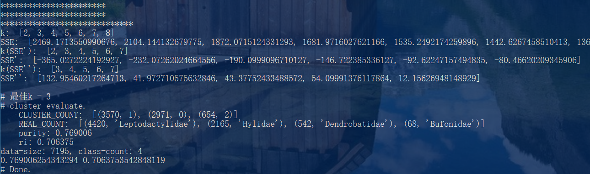
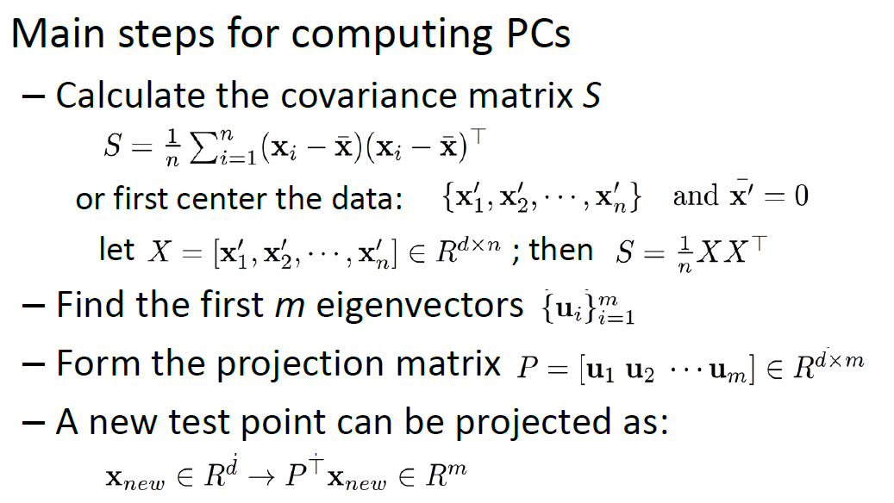
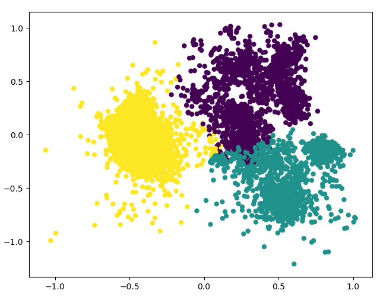
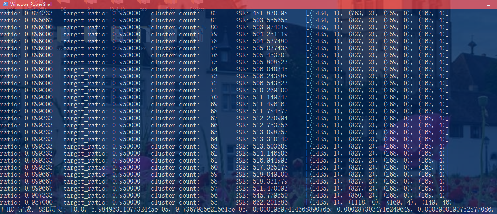
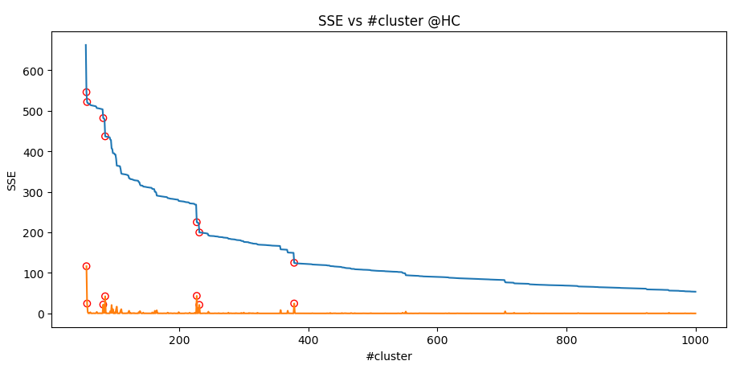
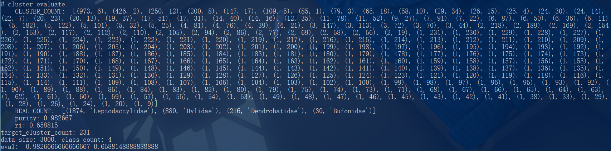
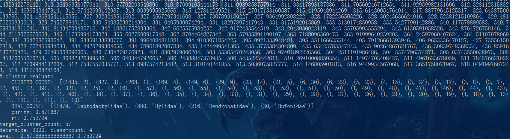

# 人工智能 Lab2-Part2 实验报告
> 实验题目：对青蛙进行聚类  
> 姓名：王博， 学号：PB16020870

## 1. 实验要求概述

### 1.1 数据集介绍
- 青蛙的声音特征保存在Frogs_MFCCs.csv文件中，前22列是归一化处理后的22维声音特征向量，接着的三列是Family、Genus和Species三个标签
- 每个样例都有对应的三个标签，可手动删去其中任意两个，留下一个作为标准结果。

### 1.2 实现算法的要求概述
- 实现一个KMeans聚类算法，实现并提交一个Python函数KMeans(k, data)
- 实现一个PCA降维算法，提交一个Python函数 PCA(data，threshold).
  - 对降维后的数据再次调用KMeans聚类算法得到结果。
  - 需要将降维后的结果进行可视化。
- 拓展内容：调研并实现层次聚类。

### 1.3 报告要求概述
- 给出KMeans算法k选择的依据；
- 在KMeans算法实验中，比较并分析PCA降维前后的纯度和兰德指数，给出图表展示和结果分析（包括降维后的散点图）
- 给出DBSCAN算法或层级聚类算法的图表分析。


## 2. 目录结构

```  
├── HC.csv
├── HC.py           # 直接在聚类数据上运行层次聚类的主函数
├── KMeans.csv
├── KMeans.py       # 直接在聚类数据上调用KMeans聚类的主函数
├── KMeans_PCA.csv 
├── KMeans_PCA.py   # 先调用PCA再KMeans聚类的主函数
├── PCA.py          # PCA算法
├── data    
│   ├── Frogs_MFCCs.csv         # KMeans使用的聚类数据
│   ├── HC_Frogs_MFCCs.csv      # HC使用的大小缩减为3000的聚类数据
│   ├── Frogs_MFCCs_origin.csv  # 原始聚类数据（冗余列未移除）
│   ├── _tool.py        # 用于生成移除一列的聚类数据
│   ├── _fake.py        # 根据 dist.bmp 生成模拟聚类数据，用于调试。
│   ├── dist.bmp        # 调试用数据分布图
│   └── fakedata.csv    # _fake.py 生成的调试用数据。
├── doc
│   └── lab2_part2.md   # Part2实验报告
└── util
    ├── evaluate.py     # 公共的评估函数
    ├── getdata.py      # 公共的数据读取函数
    └── myprint.py      # 公共的输出函数
```

## 3. 实验过程与结果分析

我选择了原始数据文件标签中的第一列作为聚类标准结果，标准结果有4个类别：
Leptodactylidae, Hylidae, Dendrobatidae, Bufonidae.

### 3.1 KMeans的实现与选择k的依据

首先实现一个需指定k的KMeans。算法原理如下所示：
```python
def KMeans(k:int, data:list):
    # 第一步：计算出数据的中心点
    ...
    # 第二步：变量和局部函数初始化
    ...
    while any_change:
        # 第一步，更新所有元素
        重新分配每个元素的中心()
        any_change = False
        for 每个数据元素:
            if 本次中心 != 上次中心:
                any_change = True
        
        # 第二步，更新所有中心
        for 每个中心：
            if 中心有点对应：
                更新中心坐标为本中心相关点的均值()
            else:
                此中心无点对应，返回异常等待重新初始化
    
    return 每个元素所属的中心编号
```
- 我选择初始点的方式是求出所有数据点的边界，在边界内随机选取。我了解到也有其它选取方式，如每次选择与已选点最远的数据点进行k次。
- 但是，光有KMeans还无法自动的，合理的选择k。选择K的方法我使用了手肘法。该方法的通过比较不同聚类结果的SSE来判断最佳的k值。
- 选择K的依据，是根据KMeans取不同的K进行多次重复实验，对于求出的平均SSE-k关系求二阶导，找出拐点。可以概括为如下伪代码：
```python

def autoKMeans(kmin:int, kmax:int, data:list, repeat=64):
    k列表 = []
    各个k的重复实验平均SSE = []
    各个k的最佳聚类结果 = []
    
    for k in kmin到kmax:
        
        for 重复repeat次:
            保存聚类结果 = KMeans(k, data)
            保存本结果的SSE = 计算SSE(data, 聚类结果)
            ...
        根据循环结果，计算SSE均值
        找出最接近SSE均值的一组
        SSE绝对差 = [abs(SSE - 平均SSE) for SSE in 所有保存的SSE]
        最接近均值的SSE下标 = SSE绝对差.下标(min(SSE绝对差))
        本k最佳聚类结果 = 所有保存的聚类结果[最接近均值的SSE下标] 
        
        # 插入这次k的数据
        保存k，平均SSE和本k最佳聚类结果
    
    计算SSE的一阶差分()
    计算SSE的二阶差分()

    最佳k = 二阶差分最大值对应的k()
    最佳聚类结果 = 最佳k对应的结果
    return 最佳聚类结果
```

上述代码也在KMeans中实现。实际运行如图：  
  
算法选出的最佳k为3。纯度有0.769，兰德系数有0.706

得到的SSE, SSE一阶差分和SSE二阶差分绘图如下：  
  
3是一阶差分变化最大的拐点。

### 3.2 主成分分析实现与可视化

- 主成分分析PCA算法的基本原理如下：  
  

- 主成分分析的实现就是用numpy将上述算法翻译为代码。对于这个聚类问题，可以不保存各个特征平均值和变换矩阵；但是对于分类问题，还要在测试集上用和训练集同样的平均值和变换矩阵进行降维，各个特征的平均值和变换矩阵需要保存。

- PCA的可视化比较简单，只需要取变换后的前两维即可：  
    
  图中可以看到多个明显的团簇。


### 3.3 使用主成分分析后的KMeans比较
- 使用PCA之后再调用KMeans。我使用的threshold是0.9，对于青蛙数据集，选取了8个主成分，总贡献率是0.921723。
- 按照4类聚类，得到的程序输出和图像分别是：  
    
    
  此时纯度有0.828，兰德系数有0.735。
- 按照前面拐点法得到的最佳3类聚类，得到的程序输出和图像分别是：  
    
    
  此时纯度有0.769，兰德系数有0.727.
  和前面未进行主成分分析的KMeans结果对比，发现聚类效果非常相近。纯度几乎相同，兰德系数的差距也很小，处理速度却有不少的提高。


### 3.4 层次聚类实现与停止时机判断

- 仍然选择数据文件标签列第一列作为标准聚类结果，有4个类别。
- 我做的是层次聚类。由于层次聚类耗时较长，（我在尽可能优化之后，运行全部数据需要2小时左右），所以我随机选择数据，将数据量减少到3000个。读取的文件是HC_Frogs_MFCCs.csv。
- 如果层次聚类的数据中含有离群点，则指定的簇的个数不应该是层次聚类过程中剩余的簇个数，否则会出现一个很大的簇和几个离群点自己形成的簇的现象。为了解决这个问题，我加入了一个大簇比例参数用于判断停止时机。
- 通过给HC函数增加一个参数 cluster_ratio（默认取值是0.95），可以保证如果大小排前n个的簇元素占比超过0.95，就不再继续合并簇，而是将所有不在大簇中的元素就近分配。

- 层次聚类的实现算法如下：
```python
def HC(data, 指定的簇个数, cluster_ratio=0.95):
    """增加了第三个默认参数，用于防止离群点干扰。
    当前指定的簇个数个最大的cluster加起来占比超过cluster_ratio，第一阶段结束。然后对于剩下的点，就近分配。
    如果不考虑离群点，可将cluster_ratio设置为大于1的数"""
    datalen = len(data)
    
    # 每个数据元素所属的cluster编号 
    元素类别编号列表 = 互不相同的数字列表
    
    # 每个cluster含有的数据元素编号
    类别到元素列表映射 = {i:[i,] for i in 取遍元素下标}

    # 距离计算函数
    def 计算簇距离(类别1编号, 类别2编号):
        return 簇之间的距离度量{最小距离/平均距离/最大距离}(
            类别到元素列表映射[类别1编号], 
            类别到元素列表映射[类别2编号])
    
    # 不同cluster对之间的距离
    簇距离缓存 = {i:{j:计算簇距离(i, j) for j in 取遍元素下标 if j != i} for i in 取遍元素下标}
    
    # 合并两个cluster
    def 合并簇(类别1编号:int, 类别2编号:int):
        # 更新元素类别编号列表
        for 类别2的每个元素:
            元素类别编号列表对应编号改为类别1
        # 合并cluster
        类别到元素列表映射[类别1编号].extend(类别到元素列表映射[类别2编号])
        # 删掉第二个cluster
        del 类别到元素列表映射[类别2编号]
        # 更新距离字典
        del 簇距离缓存[类别2编号]
        for 某个簇 in 簇距离缓存:
            del 簇距离缓存中某个簇到类别2的距离缓存
        for 某个簇 in 簇距离缓存:
            if 某个簇 不是 类别1编号:
                簇距离缓存[某个簇 到 类别1编号] = 计算簇距离(类别1编号, 某个簇)
                复制到 簇距离缓存[类别1编号 到 某个簇]

    # 获取距离最近的cluster对
    def 获取最近簇对():
        """返回：最近两个cluster的编号，以及cluster距离"""
        ......
        return 簇编号1, 簇编号2, 距离


    # 第一阶段：合并簇，使得最大的n个簇总元素个数超过指定比例
    前N个大簇总共元素个数 = 0
    前N个大簇占比 = 0
    
    # 本阶段的图表统计信息
    SSE统计表 = list()

    while 当前类别个数 > 指定的簇个数 and 前N个大簇占比 < cluster_ratio: # 引入最大n个占比控制
        统计各个cluster含有的元素个数并排序()
        找出最大n_cluster个簇占比()
        
        SSE统计表.append(计算SSE(data, 元素类别编号列表))

        cid1, cid2, _ =  获取最近簇对()
        合并簇(cid1, cid2)

    # 第二阶段：就近指派离群簇 （不再保证数据结构一致性。直接修改元素类别编号列表元素归属簇列表）
    if 当前类别个数 > 指定的簇个数:
        print("# 就近指派离群点.")
        对簇按元素个数排序()
        大簇列表 = 前 <指定的簇个数> 个簇
        小簇列表 = 剩下的所有簇
        for 小簇 in 小簇列表:
            大簇编号，距离 = 找出距离最近的大簇(小簇，大簇列表)
            # 修改元素类别编号列表
            将小簇中的元素类别都改为大簇中的元素类别()
    else:
        print("# 无需处理离群点，簇个数已满足.")

    return 压缩编码空间到1~n(元素类别编号列表)
```

- 我用层次聚类初步运行的配置如下：
  ```
  簇个数: 4
  大簇比例（cluster_ratio）: 0.95
  簇距离计算方式:   平均距离
  元素距离计算方式: 曼哈顿距离
  ```
  运行截图如下：  
    
    
  可见，考虑离群点处理之后，聚类效果比较合理：在还有55个簇的时候合并过程就停止了，经过小簇的就近分配，最终四个簇的大小为1457,1182,204,157。纯度有0.816, 兰德系数有0.72.

- 接着，我将聚类过程中SSE的变化图绘制出来，得到下图：  
    
  图中蓝线是SSE随着簇大小（层次聚类过程）的变化情况，而黄线是SSE的差分。放大簇个数较少的部分：  
    
  通过图，可以明显看到某些簇的合并大幅升高了SSE。我将SSE变化剧烈的合并位置用红圈圈出了。它们的簇大小分别是：  
  ```
  [378, 231, 227, 85, 82, 57, 56]  
  ```
  如果一次合并造成SSE显著上升，说明这两个簇虽然距离较近，但是明显可分的。因此，我猜测圈出的这些点都是较好的簇大小（对于不用进行离群点就近合并的HC算法）。因此，我尝试了簇大小231和簇大小57，运行效果如图：  
  - 簇大小231:  
    
  此时纯度有0.982，兰德系数有0.658.
  - 簇大小57:  
    
  此时纯度有0.872，兰德系数有0.753.

- 另外，我还尝试了簇之间的最小距离，最大距离，元素的欧拉距离计算方式。将所有运行过的参数列成如下表格：
  
  | 簇个数 | 合并离群点 | 大簇比例限制 | 簇距离计算 | 元素距离计算 | 纯度 | 兰德系数 |
  |:-----:|:-----:|:-----:|:-----:|:-----:|:-----:|:-----:|
  | 4 | 是 | 0.95 | 平均距离 | 曼哈顿距离 | 0.816 | 0.720 |
  | 4 | 是 | 0.95 | 平均距离 | 欧式距离 | 0.816 | 0.720 |
  | 4 | 是 | 0.95 | 最小距离 | 曼哈顿距离 | 0.638 | 0.500 |
  | 4 | 是 | 0.95 | 最大距离 | 曼哈顿距离 | 0.803 | 0.733 |
  | 57 | 否 | - | 平均距离 | 曼哈顿距离 | 0.872 | 0.753 |
  | 231 | 否 | - | 平均距离 | 曼哈顿距离 | 0.982 | 0.658 |

  前面没有列出的运行截图如下：
  - 平均距离-欧氏距离:  
    
  - 最小距离:  
    
  - 最大距离:  
    
  
  通过观察图表，可以得到一些结论：
  - 对于层次聚类@本问题，在计算元素距离时，使用欧式距离还是曼哈顿距离效果差不多。
  - 对于层次聚类@本问题，在计算簇之间的距离时，最小距离(单链接)不是很合适，最大距离(全链接)和平均距离(均链接)效果差不多。
  - 对于层次聚类@本问题，不论是使用限制大簇占比的方式，还是SSE拐点的方式，都可以解决离群点问题，防止出现大簇一个，离群点各自成簇的现象。并且，按照拐点效果不错，我按照拐点(57个簇)达到了纯度0.872，兰德系数0.753。

# 4. 实验总结

- 通过本次实验，对无监督学习有了实践了解。
- 理解了不同算法的区别，对层次聚类离群点对结果的影响进行了分析和解决。
- 对KMeans初始点的选择有了更多了解。
- 理解了PCA对于数据降维的意义。