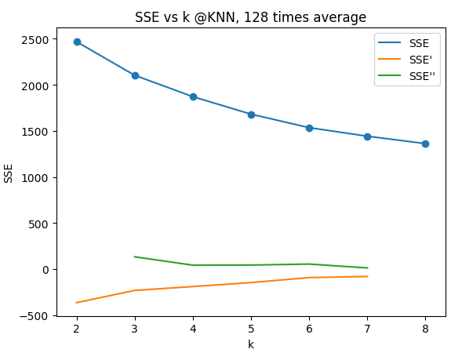
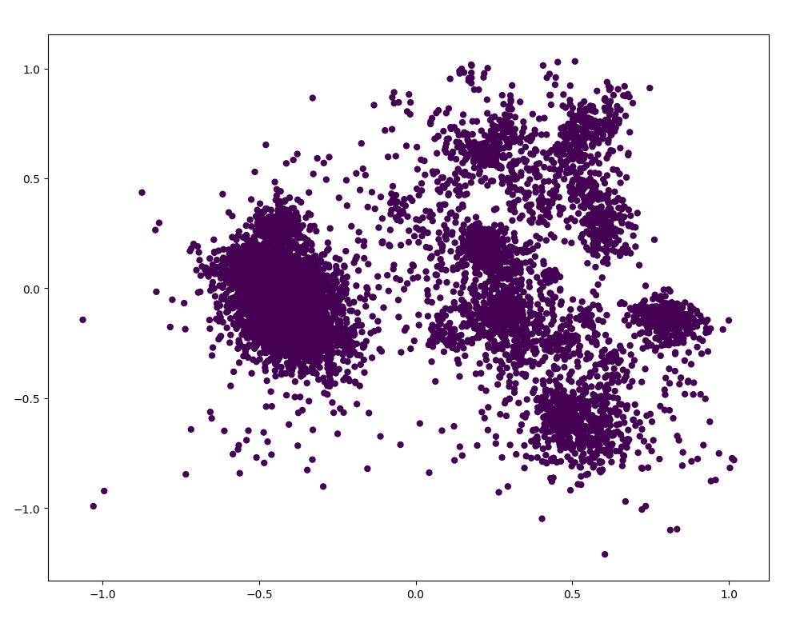
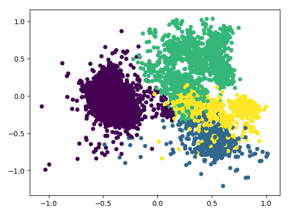

# 人工智能 Lab2-Part2 实验报告
> 实验题目：对青蛙进行聚类  
> 姓名：王博， 学号：PB16020870

## 1. 实验要求概述

### 1.1 数据集介绍
- 青蛙的声音特征保存在Frogs_MFCCs.csv文件中，前22列是归一化处理后的22维声音特征向量，接着的三列是Family、Genus和Species三个标签
- 每个样例都有对应的三个标签，可手动删去其中任意两个，留下一个作为标准结果。

### 1.2 实现算法的要求概述
- 实现一个KMeans聚类算法，实现并提交一个Python函数KMeans(k, data)
- 实现一个PCA降维算法，提交一个Python函数 PCA(data，threshold).
  - 对降维后的数据再次调用KMeans聚类算法得到结果。
  - 需要将降维后的结果进行可视化。
- 拓展内容：调研并实现层次聚类。

### 1.3 报告要求概述
- 给出KMeans算法k选择的依据；
- 在KMeans算法实验中，比较并分析PCA降维前后的纯度和兰德指数，给出图表展示和结果分析（包括降维后的散点图）
- 给出DBSCAN算法或层级聚类算法的图表分析。


## 2. 目录结构

```  
├── HC.csv
├── HC.py           # 直接在聚类数据上运行层次聚类的主函数
├── KMeans.csv
├── KMeans.py       # 直接在聚类数据上调用KMeans聚类的主函数
├── KMeans_PCA.csv 
├── KMeans_PCA.py   # 先调用PCA再KMeans聚类的主函数
├── PCA.py          # PCA算法
├── data    
│   ├── Frogs_MFCCs.csv         # 移除一列后的聚类数据
│   ├── Frogs_MFCCs_origin.csv  # 原始聚类数据
│   ├── _tool.py        # 用于生成移除一列的聚类数据
│   ├── _fake.py        # 根据 dist.bmp 生成模拟聚类数据，用于调试。
│   ├── dist.bmp        # 调试用数据分布图
│   └── fakedata.csv    # _fake.py 生成的调试用数据。
├── doc
│   └── lab2_part2.md   # Part2实验报告
└── util
    ├── evaluate.py     # 公共的评估函数
    ├── getdata.py      # 公共的数据读取函数
    └── myprint.py      # 公共的输出函数
```

## 3. 实验过程与结果分析

我选择了分类的第一列作为聚类标准结果，标准结果有4个类别：
Leptodactylidae, Hylidae, Dendrobatidae, Bufonidae.

### 3.1 KMeans的实现与选择k的依据

首先实现一个需指定k的KMeans。算法原理如下所示：
```python
def KMeans(k:int, data:list):
    # 第一步：计算出数据的中心点
    ...
    # 第二步：变量和局部函数初始化
    ...
    while any_change:
        # 第一步，更新所有元素
        重新分配每个元素的中心()
        any_change = False
        for 每个数据元素:
            if 本次中心 != 上次中心:
                any_change = True
        
        # 第二步，更新所有中心
        for 每个中心：
            if 中心有点对应：
                更新中心坐标为本中心相关点的均值()
            else:
                此中心无点对应，返回异常等待重新初始化
    
    return 每个元素所属的中心编号
```
- 但是，光有KMeans还无法自动的，合理的选择k。选择K的方法我使用了手肘法。该方法的通过比较不同聚类结果的SSE来判断最佳的k值。
- 选择K的依据，是根据KMeans取不同的K进行多次重复实验，对于求出的平均SSE-k关系求二阶导，找出拐点。可以概括为如下伪代码：
```python

def autoKMeans(kmin:int, kmax:int, data:list, repeat=64):
    k列表 = []
    各个k的重复实验平均SSE = []
    各个k的最佳聚类结果 = []
    
    for k in kmin到kmax:
        
        for 重复repeat次:
            保存聚类结果 = KMeans(k, data)
            保存本结果的SSE = 计算SSE(data, 聚类结果)
            ...
        根据循环结果，计算SSE均值
        找出最接近SSE均值的一组
        SSE绝对差 = [abs(SSE - 平均SSE) for SSE in 所有保存的SSE]
        最接近均值的SSE下标 = SSE绝对差.下标(min(SSE绝对差))
        本k最佳聚类结果 = 所有保存的聚类结果[最接近均值的SSE下标] 
        
        # 插入这次k的数据
        保存k，平均SSE和本k最佳聚类结果
    
    计算SSE的一阶差分()
    计算SSE的二阶差分()

    最佳k = 二阶差分最大值对应的k()
    最佳聚类结果 = 最佳k对应的结果
    return 最佳聚类结果
```

上述代码也在KMeans中实现。实际运行如图：  
  
算法选出的最佳k为3。纯度有0.769，兰德系数有0.706

得到的SSE, SSE一阶差分和SSE二阶差分绘图如下：  
  
3是一阶差分变化最大的拐点。

### 3.2 主成分分析实现与可视化

- 主成分分析PCA算法的基本原理如下：  
  

- 主成分分析的实现就是用numpy将上述算法翻译为代码。对于这个聚类问题，可以不保存各个特征平均值和变换矩阵；但是对于分类问题，还要在测试集上用和训练集同样的平均值和变换矩阵进行降维，各个特征的平均值和变换矩阵需要保存。

- PCA的可视化比较简单，只需要取变换后的前两维即可：  
    
  图中可以看到多个明显的团簇。


### 3.3 使用主成分分析后的KMeans比较
- 使用PCA之后再调用KMeans。我使用的threshold是0.9，对于青蛙数据集，选取了8个主成分，总贡献率是0.921723。
- 按照4类聚类，得到的程序输出和图像分别是：  
    
    
  此时纯度有0.828，兰德系数有0.735。
- 按照前面拐点法得到的最佳3类聚类，得到的程序输出和图像分别是：  
    
    
  此时纯度有0.769，兰德系数有0.727.
  和前面未进行主成分分析的KMeans结果对比，发现聚类效果非常相近。纯度几乎相同，兰德系数的差距也很小，处理速度却有不少的提高。


### 3.4 层次聚类实现与停止时机判断

选做我做的是层次聚类。

## 4. 实验总结